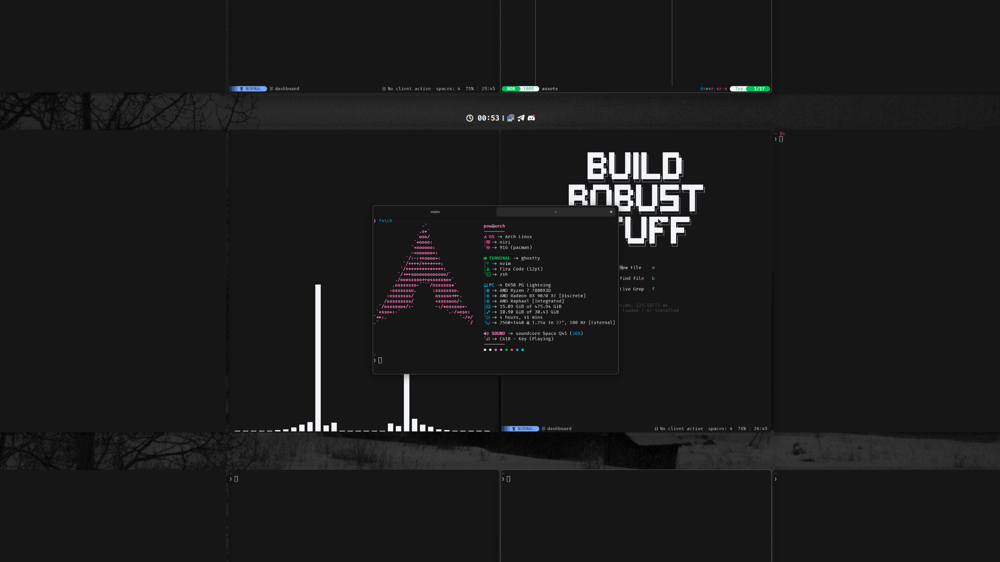

# dots
My current dev environment configurations

# Credits
[Ghostty](https://github.com/ghostty-org/ghostty) \
[Ghostty shaders](https://github.com/0xhckr/ghostty-shaders) \
[Ghostty shader playground](https://github.com/KroneCorylus/ghostty-shader-playground) \
[Niri](https://github.com/YaLTeR/niri) \
[Vicinae](https://github.com/vicinaehq/vicinae) \
[Waybar](https://github.com/Alexays/Waybar) \
[Fastfetch](https://github.com/fastfetch-cli/fastfetch) \
[Dunst](https://github.com/dunst-project/dunst) \
[SwayOSD](https://github.com/ErikReider/SwayOSD)
